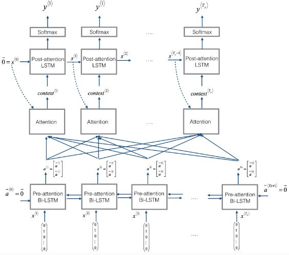
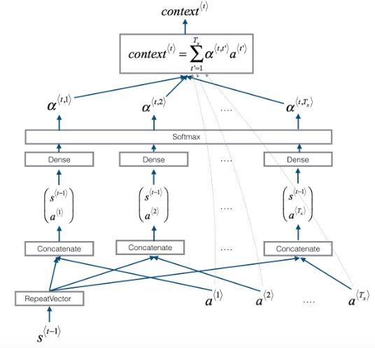
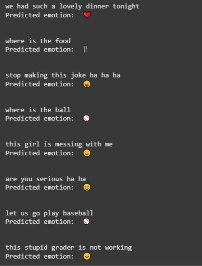
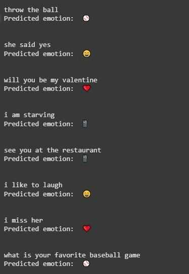
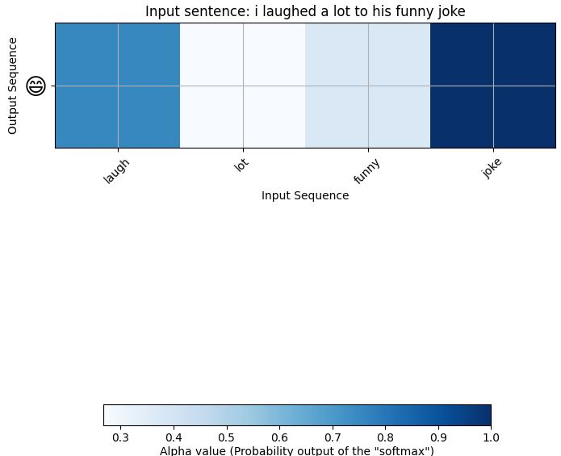

# Sentiment Analysis with Attention Mechanism and LSTM

In this project, we design a model for classifying the emotion inside a sentence. The model contains three sub-modules: 

1. **Pre-attention Bidirectional LSTM** having Tx steps. Tx is the number of words each sentence has (either padded or truncated).

2. **Self-attention calculator**, which is a simple neural network computing the attention weights between Pre-attention LSTM outputs.

3. **Post-attention LSTM** having Ty steps. Ty is the output's number of words or elements.

The output of each Post-attention LSTM is passed through a softmax and the predicted word index is obtained.

Here is a schema of our model. The left image shows the entire model and the right one shows the self-attention calculator.

 |  |
| --- | --- |

In the above images:

* $s^{\langle t-1 \rangle}$ is the output of the previous step's Post-attention LSTM, which is useful for computing step $t$ attentions ($\alpha^{\langle t \rangle} = \[ \alpha^{ \langle t , 1 \rangle}, \alpha^{ \langle t , 2 \rangle}, ... , \alpha^{{ \langle t , T_x \rangle}} \] $).  

* $context^{\langle t \rangle}$ is the multiplication of word's $t$ attention with other words $t^{\prime}$, shown as $\alpha^{ \langle t , t^{\prime} \rangle}$, and other words embeddings $a^{ \langle t^{\prime} \rangle}$.

$$context^{\langle t \rangle} = \sum\limits_{t^{\prime}=1}^{T_x} \alpha^{ \langle t , t^{\prime} \rangle} a^{\langle t^{\prime} \rangle}$$

* The initial input $x = \[ x^{ \langle 0 \rangle} , x^{ \langle 1 \rangle} , ... , x^{ \langle T_x - 1 \rangle} \]$ are sentences which first have been **lemmatized**, **stop words** are removed from them, and finally passed through **Word2Vec** embedding. 

### Viewing Output

Let's view some outputs of the model: (The output classes (emotions) are: :heart: , :baseball: , :smile: , :disappointed: , :fork_and_knife: )

 |  |
| --- | --- |

### Viewing Attention Weights

I also visualized the attention weights between words inside a sentence (after preprocessing), which is crucial in finding important words when predicting sentences labels.

